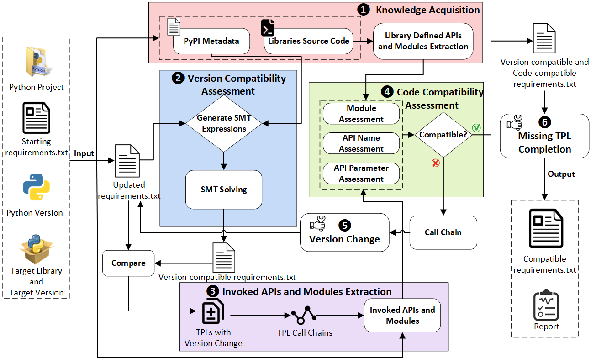

## What is PCREQ?
PCREQ is an automated tool for inferring compatible requirements for Python third-party library (TPL) upgrades. It is the first to achieve a fully automated process (end-to-end) that includes `knowledge acquisition`, `version compatibility assessment`, `invoked APIs and modules extraction`, `code compatibility assessment`, and `missing TPL completion`. PCREQ specializes in generating a compatible `requirements.txt` when upgrading a target TPL through a comprehensive analysis of both version and code compatibility issues.


For PCREQ's design and implementation details, please refer to our [paper](https://www.www.com).

## Evaluation
[REQBench](https://github.com/PCREQ/REQBench) Benchmark for Python Third-Party Libraries Upgrade.

PCREQ's evaluation results are available [here](https://github.com/PCREQ/PCREQ-evaluation).

## Usage
### Prerequisites
- Linux (tested on Ubuntu 18.04.1)
- Python 3.9.12
- thefuzz 0.22.1
- z3-solver 4.13.4.0
- packaging 24.0
- requests 2.32.3

### Step 1: Write the Configuration File
In the `configure` directory, construct a JSON configuration file, which should include the following information:
```json
{
    "projPath": "/home/usr/project",
    "requirementsPath": "/home/usr/requirements.txt",
    "targetLibrary": "pillow",
    "startVersion": "6.2.0",
    "targetVersion": "7.0.0",
    "pythonVersion": "3.7",
    "knowledgePath": "/home/usr/knowledge/"
}
```
"projPath": project path, "requirementsPath": requirements path, "targetLibrary": target third-party library name, "startVersion": current version of target third-party library, "targetVersion": target version of target third-party library,  "pythonVersion": the Python version, "knowledgePath": the path of knowledge.

Assuming that knowledge may be extensive, "knowledgePath" can be customised to other locations.


### Step 2: Knowledge Acquisition
The extracted knowledge of REQBench can be accessed at [Zenodo](https://pan.nuaa.edu.cn/share/35e84cc569877356916da00362).

**Run Command**
```shell
python knowledge_acquisition.py -config config.json
```

### Step 3: Compatible Upgraded requirements.txt Generation
**Run Command**
```shell
python main.py -config config.json
```


## Usage Example
```shell
python knowledge_acquisition.py -config config.json
python main.py -config config.json
```

### Output

The output consists of two parts: the updated `requiremens.txt` and an analysis report, which is located in the `report` directory and contains what PCREQ performed in terms of version and code compatibility checks and fixes. The contents of the report are as follows:
```
*************Upgrade pillow from 6.2.0 to 7.0.0 in PyTorch-ENet*************
Checking PyTorch-ENet is compatible with pillow7.0.0?...
PyTorch-ENet is compatible with pillow7.0.0
Checking torchvision0.3.0 is compatible with pillow7.0.0?...
torchvision0.3.0 is not compatible with pillow7.0.0-The PIL.PILLOW_VERSION is deprecated.
Checking torchvision0.4.0 is compatible with pillow7.0.0?...
torchvision0.4.0 is not compatible with pillow7.0.0-The PIL.PILLOW_VERSION is deprecated.
Checking PyTorch-ENet is compatible with torchvision0.4.0?...
PyTorch-ENet is compatible with torchvision0.4.0
Checking torchvision0.4.1 is compatible with pillow7.0.0?...
torchvision0.4.1 is not compatible with pillow7.0.0-The PIL.PILLOW_VERSION is deprecated.
Checking PyTorch-ENet is compatible with torchvision0.4.1?...
PyTorch-ENet is compatible with torchvision0.4.1
Checking torchvision0.4.2 is compatible with pillow7.0.0?...
torchvision0.4.2 is not compatible with pillow7.0.0-The PIL.PILLOW_VERSION is deprecated.
Checking PyTorch-ENet is compatible with torchvision0.4.2?...
PyTorch-ENet is compatible with torchvision0.4.2
Checking torchvision0.5.0 is compatible with pillow7.0.0?...
torchvision0.5.0 is compatible with pillow7.0.0
Checking PyTorch-ENet is compatible with torchvision0.5.0?...
PyTorch-ENet is compatible with torchvision0.5.0
Checking torchvision0.5.0 is compatible with torch1.4.0?...
torchvision0.5.0 is compatible with torch1.4.0
Checking PyTorch-ENet is compatible with torch1.4.0?...
PyTorch-ENet is compatible with torch1.4.0
*************New requirements.txt has been generated!*************
Time cost: 9.06177806854248 s
```


